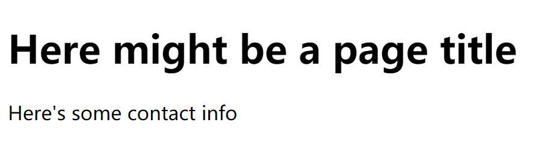

### Vue-slot新旧写法笔记

#### 前言

`v-slot` 指令自 Vue 2.6.0 起被引入，提供更好的支持 `slot` 和 `slot-scope` attribute 的 API 替代方案。在接下来所有的 2.x 版本中 `slot` 和 `slot-scope` attribute 仍会被支持，但已经被官方废弃且不会出现在 Vue 3 中。

#### slot

##### 1-1.具名插槽-旧

###### 父组件中的代码如下:

```html
<base-layout>
  <template slot="header">
    <h1>Here might be a page title</h1>
  </template>
    
  <h3>默认插槽演示</h3>
  <p>A paragraph for the main content.</p> 
  <p>And another one.</p>
    
  <template slot="footer">
    <p>Here's some contact info</p>
  </template>
</base-layout>
```

##### 或

```vue
<base-layout>
  <h1 slot="header">Here might be a page title</h1>
    
  <h3>默认插槽演示</h3>
  <p>A paragraph for the main content.</p> 
  <p>And another one.</p>
    
  <p slot="footer">Here's some contact info</p>
</base-layout>
```

###### 子组件的代码如下:

```javascript
components: {
        baseLayout: {
            template: `<div> <slot name="header"> </slot><slot name="footer"> </slot></div >`,
            }
        }
    }
```

###### render效果如下:



##### 1-2.默认插槽 - 旧

1-1中注释的代码其实是一个未命名插槽，也就是**默认插槽**，捕获所有未被匹配的内容。

单独演示:

###### 父组件代码与1-1相同:

```html
<base-layout>
	<h1 slot="header">Here might be a page title</h1>
			  
	<h3>默认插槽演示</h3>
	<p>A paragraph for the main content.</p> 
    <p>And another one.</p>
			  
	<p slot="footer">Here's some contact info</p>
</base-layout>
```

###### 子组件代码如下:

```javascript
components: {
        baseLayout: {
            template: ` <div> <slot> </slot></div > `,
            }
        }
    }
```

###### render效果如下:


##### 2-1.具名插槽-新

###### 父组件代码如下:

```html
<base-layout>
  <template v-slot:header>
    <h1>Here might be a page title</h1>
  </template>

  <p>A paragraph for the main content.</p>
  <p>And another one.</p>

  <template v-slot:footer>
    <p>Here's some contact info</p>
  </template>
</base-layout>
```

##### 或(缩写 v-slot: = #)

```html
<base-layout>
  <template #header>
    <h1>Here might be a page title</h1>
  </template>

  <p>A paragraph for the main content.</p>
  <p>And another one.</p>

  <template #footer>
    <p>Here's some contact info</p>
  </template>
</base-layout>
```

###### 子组件代码如下:

```javascript
components: {
				"base-layout": {
					template: `<div><slot name="header"></slot><slot name="footer"></slot></div>`,
					data() {
						return {
							msg: "hello"
						}
					}
				}
			}
```

###### render效果如下:


##### 2-2.默认插槽-新


###### 父组件中代码如下:

```vue
<base-layout>
  <h3>默认插槽演示</h3>
  <p>A paragraph for the main content.</p>
  <p>And another one.</p>
</base-layout>
```
